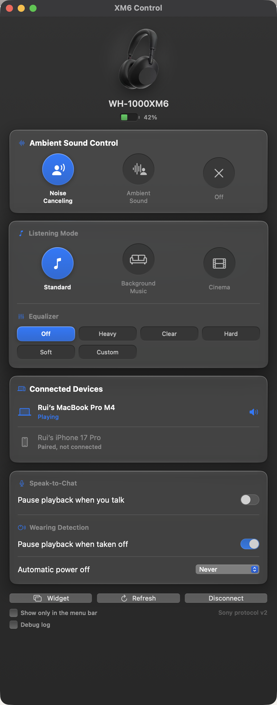

# XM6 Control

**A native macOS app for the Sony WH-1000XM6.** Control noise cancelling, ambient sound, equalizer, listening modes, and multipoint directly from your Mac. No Sony app required, no Electron, no cloud: just Swift, SwiftUI, and a direct Bluetooth connection to your headphones.

> Sony ships its Sound Connect companion app for iOS and Android, but not for macOS. This project fills that gap with a first-class Mac experience: a Liquid Glass interface, a menu bar panel, and a floating desktop widget, all speaking Sony's native headphone protocol over Bluetooth RFCOMM.

<p align="center">
  
</p>

---

## Features

| Feature | Status |
|---|---|
| Noise Cancelling / Ambient Sound / Off | ✅ with ambient level slider (0–20) and Focus on Voice |
| Listening Mode (Standard / Background Music / Cinema) | ✅ including BGM room size (My Room / Living Room / Cafe) |
| Equalizer presets (Off, Heavy, Clear, Hard, Soft, Custom) | ✅ XM6-native preset codes |
| Custom equalizer | ✅ ten band faders, written live as you drag |
| Battery level + charging status | ✅ live updates |
| Multipoint device list with names | ✅ shows all connected devices |
| Playback source switching ("Play here") | ✅ one click |
| Speak-to-Chat (sensitivity + resume timing) | ✅ |
| Wearing detection (pause when taken off) | ✅ |
| Automatic power off | ✅ |
| Menu bar quick controls | ✅ full control without opening the app |
| Floating desktop widget | ✅ draggable, all-Spaces, remembers position |
| Menu-bar-only mode | ✅ optional, hides the Dock icon; on by choice, not by default |
| Light and dark appearance | ✅ every surface tone resolves per system appearance |
| Adaptive layout | ✅ two columns in a wide window, one in a narrow one |

The app is **event-driven**: 0% CPU at idle, no polling, negligible battery impact. Nothing animates continuously; motion is limited to feedback on your own input and to state changes.

## Requirements

- macOS 13+ (Liquid Glass styling on macOS 26+, graceful fallback below)
- Xcode Command Line Tools (`xcode-select --install`). Full Xcode is not required
- A Sony WH-1000XM6 paired in **System Settings → Bluetooth**

## Build & Run

```sh
git clone <this-repo>
cd xm6-control
./Scripts/build_app.sh
open ".build/XM6 Control.app"
```

That's it. The script builds with SwiftPM, packages a double-clickable `.app`, generates the app icon, and signs the bundle. Drag `XM6 Control.app` to `/Applications` if you want it permanent, and add it to **System Settings → General → Login Items** to start it at login.

On first launch macOS asks for Bluetooth permission. Click **Allow**. Make sure the headphones are powered on and connected as an audio device before hitting **Try Again** if the first connection races.

### Window or menu bar

By default XM6 Control behaves like a normal Mac app: a Dock icon, and a window when you open it. The menu bar panel is always there too, so quick changes never need the window.

If you would rather it stay out of the way entirely, tick **Show only in the menu bar** at the bottom of the window. That drops the Dock icon and the app-switcher entry, and the menu bar panel becomes the whole interface. The same checkbox lives in that panel, so unticking it brings the window and Dock icon back.

### Avoiding permission re-prompts across rebuilds

Ad-hoc-signed apps get a new identity every build, so macOS re-asks for Bluetooth each rebuild. To fix this permanently, create a self-signed signing certificate once:

1. **Keychain Access → Certificate Assistant → Create a Certificate…**
2. Name: `XM6Dev` · Identity Type: *Self-Signed Root* · Certificate Type: **Code Signing**
3. Rebuild. The script detects `XM6Dev` automatically and uses it from then on.

### Artwork

`Sources/XM6Control/Resources/headphones.png` drives two things: the image at the top of the dashboard, and the app icon. The build script trims it to its opaque bounds and generates `AppIcon.icns` from it, so the Dock icon is the headphones themselves. A checkout without that file falls back to original vector artwork for both.

To use a photo of your own headphones instead, replace that file (a real PNG with a transparent background, not a WebP), or drop one at `~/Library/Application Support/XM6 Control/headphones.png` to change the in-app image without a rebuild.

The menu bar icon is drawn rather than taken from the photo. A menu bar image has to be a template, which keeps only its alpha, and the photo's three-quarter view collapses into a featureless blob at that size.

## Architecture

Two SwiftPM targets, cleanly separated:

```
Sources/
├── SonyHeadphonesKit/          # Protocol + transport library (no UI)
│   ├── Protocol/
│   │   ├── SonyMessage.swift   #   Frame encode/decode, escaping, checksum
│   │   ├── FrameParser.swift   #   Streaming frame reassembly
│   │   ├── Opcodes.swift       #   Command opcode tables (both message tables)
│   │   ├── Commands.swift      #   Payload builders + validating decoders
│   │   └── HeadphonesEvent.swift # Typed events from raw payloads
│   ├── Models/                 #   AmbientSoundState, EqualizerPreset, ...
│   ├── RFCOMMConnection.swift  #   IOBluetooth RFCOMM channel management
│   ├── HeadphonesController.swift # Session orchestration, ACK/sequence, state
│   └── ProtocolLog.swift       #   Optional hex-dump debug log
└── XM6Control/                 # SwiftUI app
    ├── XM6ControlApp.swift     #   Main window + menu bar extra + desktop widget
    └── Views/                  #   Dashboard cards, compact controls, widget
```

### Protocol notes

The XM6 speaks Sony's proprietary MDR protocol over RFCOMM (service UUID `96CC203E-5068-46ad-B32D-E316F5E069BA`): framed messages with an alternating sequence bit, per-frame ACKs, and two independent opcode tables. The XM6 generation moved several features to new command families relative to older 1000X models: the equalizer answers a different inquired type, wearing detection moved to the SYSTEM family, and multipoint management lives on the second message table. All command layouts used here were verified against a live WH-1000XM6 (firmware 3.x) via the built-in protocol log.

Enable **Debug logging** at the bottom of the main window to capture a hex transcript of every frame at `~/Library/Application Support/XM6 Control/protocol.log`. That transcript is what makes adding features or supporting new firmware practical.

## Troubleshooting

| Symptom | Fix |
|---|---|
| "Couldn't find a paired WH-1000XM6" | Pair the headphones in System Settings → Bluetooth first |
| Connect fails immediately | Make sure the headphones show as *Connected* (audio) in the Bluetooth menu, then Try Again |
| Stuck on "Connecting…", or "macOS reported no Bluetooth services" | Disconnect and reconnect the headphones. See [below](#stuck-on-connecting-disconnect-and-reconnect) |
| Bluetooth permission prompt after rebuild | Expected with ad-hoc signing. See the `XM6Dev` certificate setup above |
| A card shows "state not reported" | That query wasn't answered; controls still work. Enable debug logging and open an issue with the log |
| Menu bar icon missing | The app may not be running. Launch it again |
| No Dock icon and no window | "Show only in the menu bar" is enabled. Uncheck it from the menu bar panel to get the window and Dock icon back |

### Stuck on "Connecting…": disconnect and reconnect

Occasionally the headphones connect to macOS for **audio only**, without the rest of the Bluetooth profiles. Music plays normally, so everything looks fine, but the Sony control service isn't published, and there is nothing for the app to talk to.

You can confirm it:

```sh
system_profiler SPBluetoothDataType | grep -A6 "WH-1000XM6"
```

Look at the `Services:` line. A healthy link looks like this:

```
Services: 0x800039 < HFP AVRCP A2DP HID ACL >
```

A degraded one shows only `< A2DP ACL >`. In that state macOS reports **no service records at all** for the headphones, service discovery returns nothing, and no RFCOMM channel can be opened.

**The fix is to disconnect the headphones and reconnect them** from the Bluetooth menu, which makes macOS renegotiate the full set of profiles. If the `Services:` line still comes back short, remove the device in System Settings → Bluetooth and pair it again to force fresh service discovery.

This is a quirk of how the link is negotiated, not something the app can repair from its side: the profiles are already missing by the time it connects. What the app does do is stop waiting: it gives up after about 8 seconds, retries once, and then tells you what happened instead of spinning indefinitely.

## Acknowledgements

This project stands on the shoulders of the open-source Sony reverse-engineering community:

- [Gadgetbridge](https://codeberg.org/Freeyourgadget/Gadgetbridge), the most battle-tested implementation of the Sony MDR protocol
- [SonyHeadphonesClient](https://github.com/Plutoberth/SonyHeadphonesClient) and the [mos9527 fork](https://github.com/mos9527/SonyHeadphonesClient), whose XM6 support documented the new-generation command families

## Disclaimer

This is an independent open-source project. It is not affiliated with, endorsed by, or supported by Sony. "Sony", "WH-1000XM6", and "Sound Connect" are trademarks of Sony Group Corporation. Use at your own risk.

## License

[MIT](LICENSE)
